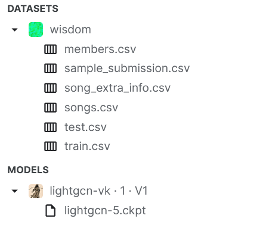

### Solution for VK-ML intern task

All the necessary explanations are inside the notebook.

There I've explained my decisions about EDA, data preparation, feature engineering, model training and evaluation.

LightGCN model structure is taken from VK Recsys 2024 course, which I've completed a few weeks ago.

In order to replicate the results, you need to place all the files from WSDM dataset into 'DATA-DIR' and uncomment lightGCN training.

Data and model structure is as follows:

